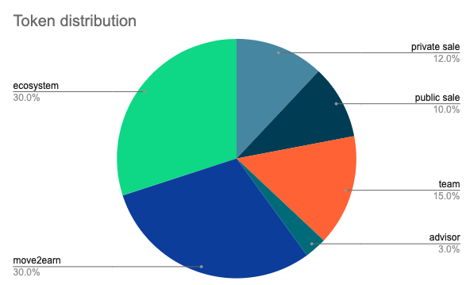

# 经济模型 

## 代币
PrayDAO将具有双重 Token，分别是交互游戏 Token（SCORE）和治理 Token（HOPE）。

SCORE 用于PrayApp各种应用场景内的活动，例如创造新的神像、更换场景背景和升级神像莲花底座等。

HOPE作为 PrayDAO官方发布的唯一通证，是 PrayDAO生态系统的治理代币,主要用于PrayApp活动所形成的利润分配和PrayApp发展方向、功能的投票等治理活动。

SCORE 的供应是无限的，用户在纪念和祈祷交互过程当中时会产生。

HOPE则是有限的，总量为60亿枚。

根据用户所拥有的神像NFT数量、属性和应用场景的人气值，PrayApp按照周向用户发放。PrayDAO也会不定期的向持有7，8，9级神像NFT（创世神像NFT为9级）的用户空投。

HOPE收益率是用户 SCORE收益率的10%；例如，用户每赚取 10个 SCORE就会得到 1个 HOPE。

## 治理Token分发机制
治理Token名称： HOPE

协议标准：ERC20/TRC20 

发行日期：2023

发行平台：待定

计划发行量：60亿

发行价：待定

分配机制： PrayDAO的所有Token将全部用于PrayApp的开发、推广和应用,永不增发，其中30%用于被分配给参加活动和治理的用户。30%的生态基金会被用于空投及社区的激励。40%用于PrayApp用户的SCORE兑换。

为保证治理Token整体生态的健康长久发展， 每两年 Token 的释放将会减半, 或每个月进行一次公开燃烧。
 

## 治理Token 的商业模式

Token的治理权益：Token持有者将拥有投票权；处置 PrayDAO 生态内的神像NFT；决定PrayApp的未来；并且根据持有量参与不同级别PrayDAO的活动。

<!--
 
-->